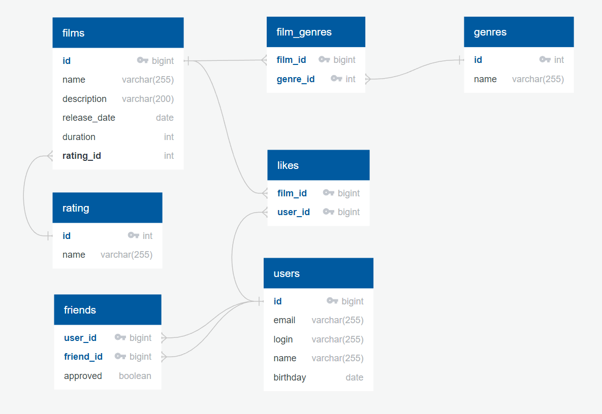

# java-filmorate

### Модель базы данных представлена на ER-диаграмме

---


### Примеры запросов

---

<details>
<summary>Для фильмов:</summary>

* Получение всех фильмов:
```SQL
SELECT f.film_id,
       f.name,
       f.description,
       f.release_date,
       f.duration,
       mp.name AS mpa_rating,
FROM films AS f
JOIN mpa_ratings AS mp ON f.mpa_rating_id = mp.rating_id;
```

* Получение фильма по идентификатору:
```SQL
SELECT f.film_id,
       f.name,
       f.description,
       f.release_date,
       f.duration,
       mp.name AS mpa_rating,
FROM films AS f
JOIN mpa_ratings AS mp ON f.mpa_rating_id = mp.rating_id
WHERE f.film_id = ?;
```

* Получение топ-чарта фильмов по количеству лайков:
```SQL
SELECT f.film_id,
       f.name,
       f.description,
       f.release_date,
       f.duration,
       mp.name AS mpa_rating,
       COUNT(fl.user_id) AS likes
FROM films AS f
JOIN mpa_ratings AS mp ON f.mpa_rating_id = mp.rating_id
LEFT JOIN film_likes AS fl ON f.film_id = fl.film_id
GROUP BY f.film_id
ORDER BY like_count DESC 
LIMIT ?;
```
</details>

<details>
<summary>Для пользователей:</summary>

* Получение всех пользователей:

```SQL
SELECT *
FROM user
```

* Получение пользователя по идентификатору:
```SQL
SELECT *
FROM user
WHERE user_id = ?
```   

</details>
